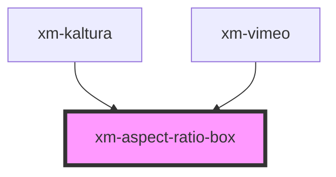

# xm-aspect-ratio-box

<!-- Auto Generated Below -->

## Properties

| Property | Attribute | Description                  | Type     | Default  |
| -------- | --------- | ---------------------------- | -------- | -------- |
| `ratio`  | `ratio`   | Video ratio, default is 16:9 | `number` | `0.5625` |

## Dependencies

### Used by

 - [xm-kaltura](../providers/kaltura)
 - [xm-vimeo](../providers/vimeo)

### Graph

----------------------------------------------

*Built with [StencilJS](https://stenciljs.com/)*
