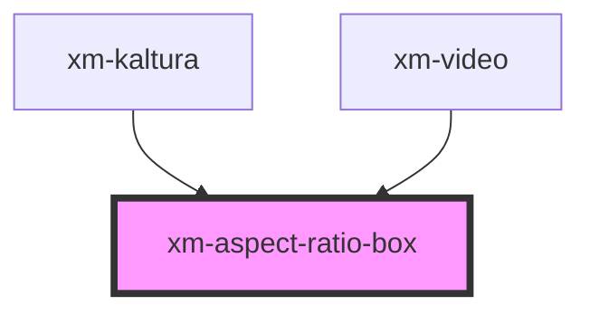

# xm-aspect-ratio-box

<!-- Auto Generated Below -->

## Properties

| Property | Attribute | Description | Type     | Default |
| -------- | --------- | ----------- | -------- | ------- |
| `ratio`  | `ratio`   |             | `number` | `1`     |

## Dependencies

### Used by

 - [xm-kaltura](../provider)
 - [xm-video](../video)

### Graph

----------------------------------------------

*Built with [StencilJS](https://stenciljs.com/)*
