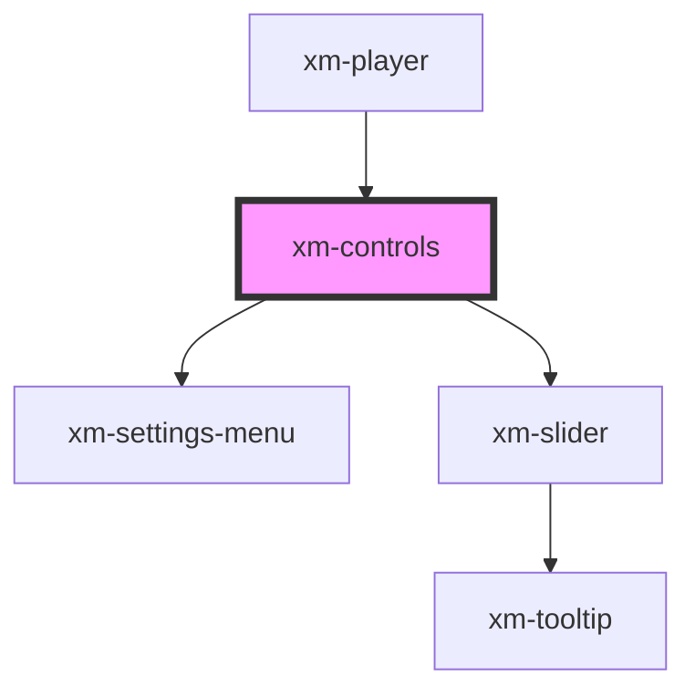

# xm-controls

<!-- Auto Generated Below -->

## Properties

| Property               | Attribute | Description | Type                   | Default     |
| ---------------------- | --------- | ----------- | ---------------------- | ----------- |
| `status`               | --        |             | `Status`               | `undefined` |
| `textTracks`           | --        |             | `TextTrackList`        | `undefined` |
| `toggleControlButtons` | --        |             | `ToggleControlProps[]` | `undefined` |

## Events

| Event                                    | Description                   | Type                              |
| ---------------------------------------- | ----------------------------- | --------------------------------- |
| `control:changePlaybackRate`             |                               | `CustomEvent<any>`                |
| `control:changeToggleControlActiveState` | Event hook for custom control | `CustomEvent<ToggleControlProps>` |
| `control:changeVolume`                   |                               | `CustomEvent<any>`                |
| `control:closeSettingsMenu`              |                               | `CustomEvent<any>`                |
| `control:disableTextTrack`               |                               | `CustomEvent<any>`                |
| `control:enableTextTrack`                |                               | `CustomEvent<any>`                |
| `control:enterFullscreen`                |                               | `CustomEvent<any>`                |
| `control:exitFullscreen`                 |                               | `CustomEvent<any>`                |
| `control:hidePlaybackRate`               |                               | `CustomEvent<any>`                |
| `control:mute`                           |                               | `CustomEvent<any>`                |
| `control:openSettingsMenu`               |                               | `CustomEvent<any>`                |
| `control:pause`                          |                               | `CustomEvent<any>`                |
| `control:play`                           |                               | `CustomEvent<any>`                |
| `control:showPlaybackRate`               |                               | `CustomEvent<any>`                |
| `control:unmute`                         |                               | `CustomEvent<any>`                |

## Dependencies

### Used by

 - [xm-player](../player)

### Depends on

- [xm-settings-menu](../settings-menu)
- [xm-slider](../slider)

### Graph

----------------------------------------------

*Built with [StencilJS](https://stenciljs.com/)*
