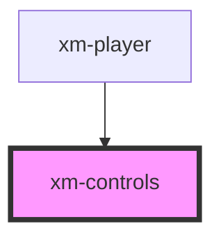

# xm-controls

<!-- Auto Generated Below -->

## Properties

| Property | Attribute | Description | Type     | Default     |
| -------- | --------- | ----------- | -------- | ----------- |
| `status` | --        |             | `Status` | `undefined` |

## Events

| Event                     | Description | Type               |
| ------------------------- | ----------- | ------------------ |
| `control:changeVolume`    |             | `CustomEvent<any>` |
| `control:enterFullscreen` |             | `CustomEvent<any>` |
| `control:exitFullscreen`  |             | `CustomEvent<any>` |
| `control:mute`            |             | `CustomEvent<any>` |
| `control:pause`           |             | `CustomEvent<any>` |
| `control:play`            |             | `CustomEvent<any>` |
| `control:seek`            |             | `CustomEvent<any>` |
| `control:unmute`          |             | `CustomEvent<any>` |

## Dependencies

### Used by

 - [xm-player](../player)

### Graph

----------------------------------------------

*Built with [StencilJS](https://stenciljs.com/)*
