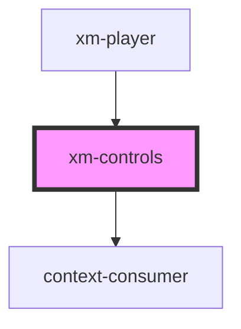

# xm-controls

<!-- Auto Generated Below -->

## Events

| Event   | Description | Type               |
| ------- | ----------- | ------------------ |
| `pause` |             | `CustomEvent<any>` |
| `play`  |             | `CustomEvent<any>` |

## Dependencies

### Used by

 - [xm-player](../player)

### Depends on

- context-consumer

### Graph

----------------------------------------------

*Built with [StencilJS](https://stenciljs.com/)*
