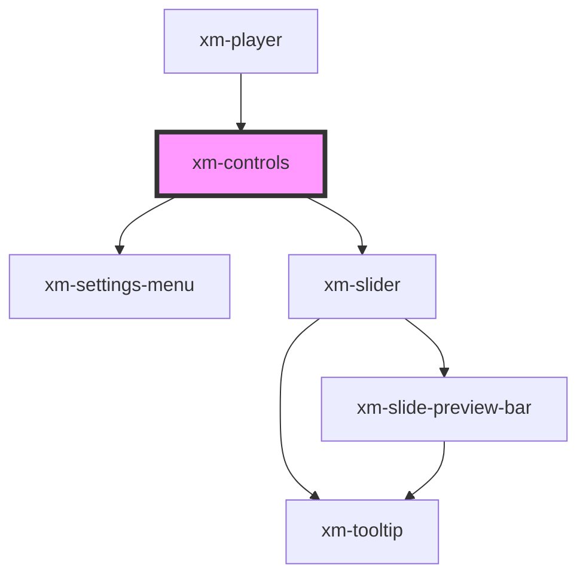

# xm-controls

<!-- Auto Generated Below -->

## Properties

| Property               | Attribute                | Description                            | Type                   | Default     |
| ---------------------- | ------------------------ | -------------------------------------- | ---------------------- | ----------- |
| `slidesSrc`            | `slides-src`             | JSON encoded sources for slides        | `string`               | `undefined` |
| `status`               | `status`                 | Player status                          | `Status`               | `undefined` |
| `textTracks`           | `text-tracks`            | List of text tracks                    | `TextTrackList`        | `undefined` |
| `toggleControlButtons` | `toggle-control-buttons` | Array of toggle control configurations | `ToggleControlProps[]` | `undefined` |

## Events

| Event                                    | Description                                   | Type                              |
| ---------------------------------------- | --------------------------------------------- | --------------------------------- |
| `control:changePlaybackRate`             | Emitted when the playback rate is changed     | `CustomEvent<any>`                |
| `control:changeToggleControlActiveState` | Event hook for custom control                 | `CustomEvent<ToggleControlProps>` |
| `control:changeVolume`                   | Emitted when the volume is changed            | `CustomEvent<any>`                |
| `control:closeSettingsMenu`              | Emitted when the settings menu is closed      | `CustomEvent<any>`                |
| `control:disableTextTrack`               | Emitted when the text track is disabled       | `CustomEvent<any>`                |
| `control:enableTextTrack`                | Emitted when the text track is enabled        | `CustomEvent<any>`                |
| `control:enterFullscreen`                | Emitted when the full screen is entered       | `CustomEvent<any>`                |
| `control:exitFullscreen`                 | Emitted when the full screen is exited        | `CustomEvent<any>`                |
| `control:hidePlaybackRate`               | Emitted when the playback rate menu is closed | `CustomEvent<any>`                |
| `control:mute`                           | Emitted when volume is muted                  | `CustomEvent<any>`                |
| `control:openSettingsMenu`               | Emitted when the settings menu is opened      | `CustomEvent<any>`                |
| `control:pause`                          | Emitted on pause                              | `CustomEvent<any>`                |
| `control:play`                           | Emitted on play                               | `CustomEvent<any>`                |
| `control:showPlaybackRate`               | Emitted when the playback rate menu is opened | `CustomEvent<any>`                |
| `control:unmute`                         | Emitted when volume is unmuted                | `CustomEvent<any>`                |

## Dependencies

### Used by

 - [xm-player](../player)

### Depends on

- [xm-settings-menu](../settings-menu)
- [xm-slider](../slider)

### Graph

----------------------------------------------

*Built with [StencilJS](https://stenciljs.com/)*
