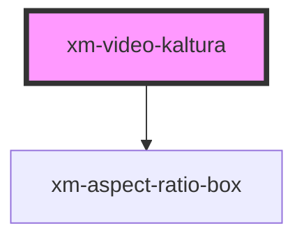

# xm-video-kaltura

<!-- Auto Generated Below -->

## Properties

| Property    | Attribute    | Description | Type     | Default     |
| ----------- | ------------ | ----------- | -------- | ----------- |
| `entryId`   | `entry-id`   |             | `string` | `undefined` |
| `partnerId` | `partner-id` |             | `number` | `undefined` |
| `volume`    | `volume`     |             | `number` | `undefined` |

## Events

| Event         | Description | Type                             |
| ------------- | ----------- | -------------------------------- |
| `ratioLoaded` |             | `CustomEvent<RatioLoadedDetail>` |
| `timeupdate`  |             | `CustomEvent<TimeUpdateDetail>`  |

## Methods

### `currentTime() => Promise<any>`

#### Returns

Type: `Promise<any>`

### `pause() => Promise<void>`

#### Returns

Type: `Promise<void>`

### `play() => Promise<void>`

#### Returns

Type: `Promise<void>`

### `seek(seconds: number) => Promise<number>`

#### Returns

Type: `Promise<number>`

### `setPlaybackRate(playbackRate: number) => Promise<number>`

#### Returns

Type: `Promise<number>`

## Dependencies

### Depends on

- [xm-aspect-ratio-box](../aspect-ratio-box)

### Graph

----------------------------------------------

*Built with [StencilJS](https://stenciljs.com/)*
