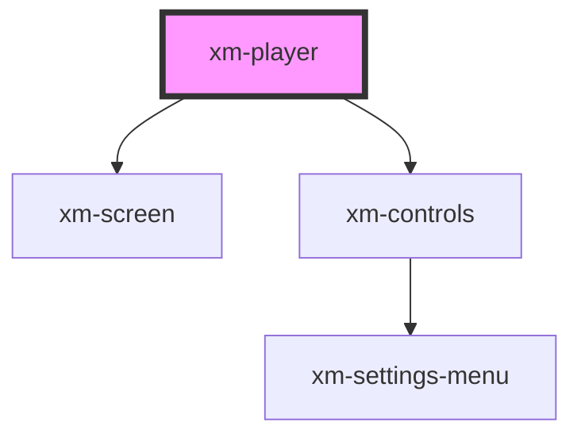

# video-player

<!-- Auto Generated Below -->

## Properties

| Property | Attribute | Description | Type     | Default                |
| -------- | --------- | ----------- | -------- | ---------------------- |
| `volume` | `volume`  |             | `number` | `defaultStatus.volume` |

## Methods

### `mute() => Promise<void>`

#### Returns

Type: `Promise<void>`

### `pause() => Promise<void>`

#### Returns

Type: `Promise<void>`

### `play() => Promise<void>`

#### Returns

Type: `Promise<void>`

### `seek(seconds: number) => Promise<void>`

#### Returns

Type: `Promise<void>`

### `unmute() => Promise<void>`

#### Returns

Type: `Promise<void>`

## Dependencies

### Depends on

- [xm-screen](../screen)
- [xm-controls](../controls)

### Graph

----------------------------------------------

*Built with [StencilJS](https://stenciljs.com/)*
