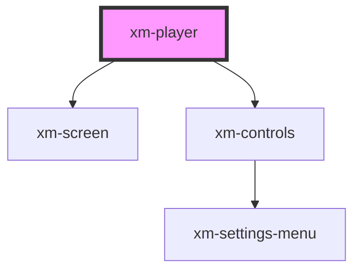

# video-player

All css variables are defined in the _vars.scss partial file.
The namespae for :root or xm-player definitions from the outside is: "--vps-variable-name" eg --vps-slider-color.
And intern we used: "--vp-variable-name" eg --vp-slider-color.
Now you can define default values for all used variables. :)

<!-- Auto Generated Below -->

## Properties

| Property       | Attribute      | Description | Type      | Default                               |
| -------------- | -------------- | ----------- | --------- | ------------------------------------- |
| `lang`         | `lang`         |             | `string`  | `undefined`                           |
| `playbackrate` | `playbackrate` |             | `number`  | `defaultStatus.settings.playbackRate` |
| `showsubtitle` | `showsubtitle` |             | `boolean` | `defaultStatus.subtitle.enabled`      |
| `volume`       | `volume`       |             | `number`  | `defaultStatus.volume`                |

## Events

| Event                     | Description | Type                                   |
| ------------------------- | ----------- | -------------------------------------- |
| `notifyActiveCuesUpdated` |             | `CustomEvent<CueListChangeEventProps>` |
| `notifyCueListChanged`    |             | `CustomEvent<CueListChangeEventProps>` |

## Methods

### `disableTextTrack() => Promise<void>`

#### Returns

Type: `Promise<void>`

### `enableTextTrack() => Promise<void>`

#### Returns

Type: `Promise<void>`

### `mute() => Promise<void>`

#### Returns

Type: `Promise<void>`

### `pause() => Promise<void>`

#### Returns

Type: `Promise<void>`

### `play() => Promise<void>`

#### Returns

Type: `Promise<void>`

### `seek(seconds: number) => Promise<void>`

#### Returns

Type: `Promise<void>`

### `unmute() => Promise<void>`

#### Returns

Type: `Promise<void>`

## Dependencies

### Depends on

- [xm-screen](../screen)
- [xm-controls](../controls)

### Graph

----------------------------------------------

*Built with [StencilJS](https://stenciljs.com/)*
