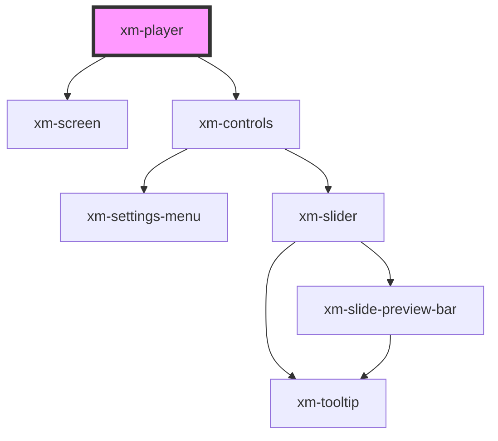

# video-player

All css variables are defined in the `_vars.scss` file.
The namespace for `:root` or `xm-player` definitions from the outside is: `--vps-variable-name` e.g. `--vps-slider-color`.
And intern we use `--vp-variable-name` e.g. `--vp-slider-color`.

## Special behavior

On small screens, the volume slider is hidden to allow more space for the short-cut keys.
If the `volume` property is set lower than 1.0, this setting is ignored on small devices.
The user can still change the volume with the device keys.

<!-- Auto Generated Below -->

## Properties

| Property       | Attribute      | Description | Type      | Default                               |
| -------------- | -------------- | ----------- | --------- | ------------------------------------- |
| `lang`         | `lang`         |             | `string`  | `undefined`                           |
| `playbackrate` | `playbackrate` |             | `number`  | `defaultStatus.settings.playbackRate` |
| `showsubtitle` | `showsubtitle` |             | `boolean` | `defaultStatus.subtitle.enabled`      |
| `slidesSrc`    | `slides-src`   |             | `string`  | `undefined`                           |
| `volume`       | `volume`       |             | `number`  | `defaultStatus.volume`                |

## Events

| Event                     | Description                                                                                                                         | Type                                   |
| ------------------------- | ----------------------------------------------------------------------------------------------------------------------------------- | -------------------------------------- |
| `notifyActiveCuesUpdated` | Emits list of currently active/visible cues by language and second to notifies external listeners that the active cues have changed | `CustomEvent<CueListChangeEventProps>` |
| `notifyCueListChanged`    | Emits list of cues of currently selected language.                                                                                  | `CustomEvent<CueListChangeEventProps>` |

## Methods

### `disableTextTrack() => Promise<void>`

#### Returns

Type: `Promise<void>`

### `enableTextTrack() => Promise<void>`

#### Returns

Type: `Promise<void>`

### `getShortcutKeys() => Promise<Array<string>>`

Values of the keyboard keys the player listens to on the 'keydown` event

#### Returns

Type: `Promise<string[]>`

### `mute() => Promise<void>`

Sets the mute state true and the primary slot volume to 0.

#### Returns

Type: `Promise<void>`

### `pause() => Promise<void>`

#### Returns

Type: `Promise<void>`

### `play() => Promise<void>`

#### Returns

Type: `Promise<void>`

### `seek(seconds: number) => Promise<void>`

#### Returns

Type: `Promise<void>`

### `unmute() => Promise<void>`

Sets the mute state false and resets the primary slot video volume.

#### Returns

Type: `Promise<void>`

## Dependencies

### Depends on

- [xm-screen](../screen)
- [xm-controls](../controls)

### Graph

----------------------------------------------

*Built with [StencilJS](https://stenciljs.com/)*
