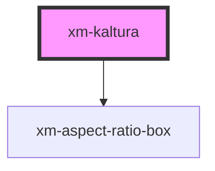

# xm-kaltura

<!-- Auto Generated Below -->

## Properties

| Property    | Attribute    | Description                                                                                                         | Type      | Default     |
| ----------- | ------------ | ------------------------------------------------------------------------------------------------------------------- | --------- | ----------- |
| `active`    | `active`     |                                                                                                                     | `boolean` | `false`     |
| `duration`  | `duration`   | Duration of the video in seconds                                                                                    | `number`  | `undefined` |
| `entryId`   | `entry-id`   |                                                                                                                     | `string`  | `undefined` |
| `partnerId` | `partner-id` |                                                                                                                     | `number`  | `undefined` |
| `poster`    | `poster`     | URL for a poster to be displayed initially                                                                          | `string`  | `undefined` |
| `ratio`     | `ratio`      | Number resulting from dividing the height by the width of the video. Common ratios are 0.75 (4:3) and 0.5625 (16:9) | `number`  | `undefined` |
| `volume`    | `volume`     |                                                                                                                     | `number`  | `undefined` |

## Events

| Event         | Description                                                                                                                     | Type                             |
| ------------- | ------------------------------------------------------------------------------------------------------------------------------- | -------------------------------- |
| `ended`       | Emit when video has ended                                                                                                       | `CustomEvent<any>`               |
| `pause`       |                                                                                                                                 | `CustomEvent<any>`               |
| `play`        |                                                                                                                                 | `CustomEvent<any>`               |
| `ratioLoaded` | Emit ratio as soon as it is available                                                                                           | `CustomEvent<RatioLoadedDetail>` |
| `seeked`      |                                                                                                                                 | `CustomEvent<any>`               |
| `timeupdate`  | Emit timeupdate event to update player controls with duration This needs to happen once initially and on every video timeupdate | `CustomEvent<TimeUpdateDetail>`  |

## Methods

### `currentTime() => Promise<any>`

Call getCurrentTime on the Kaltura player

If the player is not initialized, it will save the function
so it can be applied once the player is ready.

#### Returns

Type: `Promise<any>`

### `pause() => Promise<void>`

Call pause on the Kaltura player

If the player is not initialized, it will save the function
so it can be applied once the player is ready.

#### Returns

Type: `Promise<void>`

### `play() => Promise<void>`

Call play on the Kaltura player

If the player is not initialized, it will save the function
so it can be applied once the player is ready.

#### Returns

Type: `Promise<void>`

### `seek(seconds: number) => Promise<number>`

Call seek on the Kaltura player

If the player is not initialized, it will save the function
so it can be applied once the player is ready.

#### Returns

Type: `Promise<number>`

### `setPlaybackRate(playbackRate: number) => Promise<number>`

Call setPlaybackRate on the Kaltura player

If the player is not initialized, it will save the function
so it can be applied once the player is ready.

#### Returns

Type: `Promise<number>`

## Dependencies

### Depends on

- [xm-aspect-ratio-box](../../aspect-ratio-box)

### Graph

----------------------------------------------

*Built with [StencilJS](https://stenciljs.com/)*
