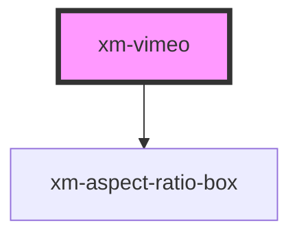

# xmf-source

<!-- Auto Generated Below -->

## Properties

| Property | Attribute | Description    | Type      | Default     |
| -------- | --------- | -------------- | --------- | ----------- |
| `active` | `active`  |                | `boolean` | `false`     |
| `src`    | `src`     | Vimeo Video ID | `number`  | `undefined` |
| `volume` | `volume`  |                | `number`  | `undefined` |

## Events

| Event         | Description                                                                                                                     | Type               |
| ------------- | ------------------------------------------------------------------------------------------------------------------------------- | ------------------ |
| `buffered`    | The buffered event is not handled to use the build in loading indicator.                                                        | `CustomEvent<any>` |
| `buffering`   | The buffering event is not handled to use the build in loading indicator.                                                       | `CustomEvent<any>` |
| `ended`       | Emit when video has ended                                                                                                       | `CustomEvent<any>` |
| `pause`       |                                                                                                                                 | `CustomEvent<any>` |
| `play`        |                                                                                                                                 | `CustomEvent<any>` |
| `progress`    |                                                                                                                                 | `CustomEvent<any>` |
| `ratioLoaded` | Emit ratio as soon as it is available                                                                                           | `CustomEvent<any>` |
| `seeked`      |                                                                                                                                 | `CustomEvent<any>` |
| `seeking`     |                                                                                                                                 | `CustomEvent<any>` |
| `timeupdate`  | Emit timeupdate event to update player controls with duration This needs to happen once initially and on every video timeupdate | `CustomEvent<any>` |

## Methods

### `currentTime() => Promise<number>`

Call getCurrentTime on the Vimeo player

If the player is not initialized, it will save the function
so it can be applied once the player is ready.

#### Returns

Type: `Promise<number>`

### `pause() => Promise<void>`

Call pause on the Vimeo player

If the player is not initialized, it will save the function
so it can be applied once the player is ready.

#### Returns

Type: `Promise<void>`

### `play() => Promise<void>`

Call play on the Vimeo player

If the player is not initialized, it will save the function
so it can be applied once the player is ready.

#### Returns

Type: `Promise<void>`

### `seek(seconds: number) => Promise<number>`

Call seek on the Vimeo player

If the player is not initialized, it will save the function
so it can be applied once the player is ready.

#### Parameters

| Name      | Type     | Description |
| --------- | -------- | ----------- |
| `seconds` | `number` |             |

#### Returns

Type: `Promise<number>`

### `setPlaybackRate(playbackRate: number) => Promise<number>`

Call setPlaybackRate on the Vimeo player

If the player is not initialized, it will save the function
so it can be applied once the player is ready.

#### Parameters

| Name           | Type     | Description |
| -------------- | -------- | ----------- |
| `playbackRate` | `number` |             |

#### Returns

Type: `Promise<number>`

## Dependencies

### Depends on

- [xm-aspect-ratio-box](../../aspect-ratio-box)

### Graph

----------------------------------------------

*Built with [StencilJS](https://stenciljs.com/)*
