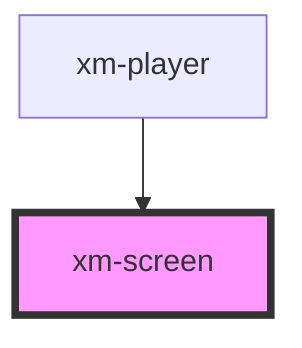

# xm-screen

<!-- Auto Generated Below -->

## Properties

| Property | Attribute | Description | Type      | Default     |
| -------- | --------- | ----------- | --------- | ----------- |
| `pip`    | `pip`     |             | `boolean` | `undefined` |

## Dependencies

### Used by

 - [xm-player](../player)

### Graph

----------------------------------------------

*Built with [StencilJS](https://stenciljs.com/)*
