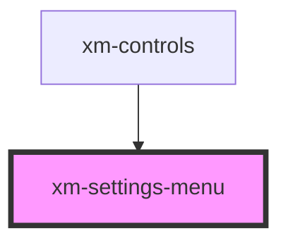

# xm-settings-menu

<!-- Auto Generated Below -->

## Properties

| Property     | Attribute | Description | Type            | Default     |
| ------------ | --------- | ----------- | --------------- | ----------- |
| `status`     | --        |             | `Status`        | `undefined` |
| `textTracks` | --        |             | `TextTrackList` | `undefined` |

## Events

| Event                        | Description | Type               |
| ---------------------------- | ----------- | ------------------ |
| `setting:changePlaybackRate` |             | `CustomEvent<any>` |
| `setting:changeTextTrack`    |             | `CustomEvent<any>` |

## Dependencies

### Used by

 - [xm-controls](../controls)

### Graph

----------------------------------------------

*Built with [StencilJS](https://stenciljs.com/)*
