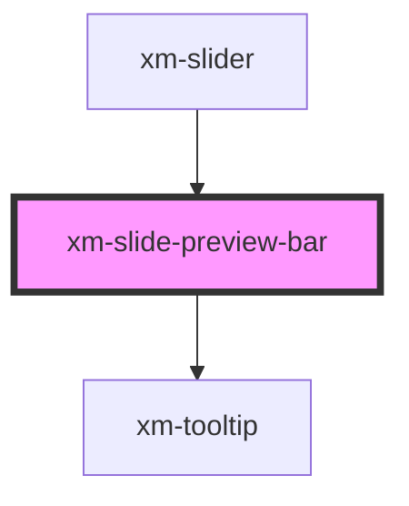

# xm-slide-preview-bar

<!-- Auto Generated Below -->

## Properties

| Property    | Attribute    | Description | Type                        | Default     |
| ----------- | ------------ | ----------- | --------------------------- | ----------- |
| `duration`  | `duration`   |             | `number`                    | `undefined` |
| `onSeek`    | --           |             | `(seconds: number) => void` | `undefined` |
| `slidesSrc` | `slides-src` |             | `string`                    | `undefined` |

## Dependencies

### Used by

 - [xm-slider](../slider)

### Depends on

- [xm-tooltip](../tooltip)

### Graph

----------------------------------------------

*Built with [StencilJS](https://stenciljs.com/)*
