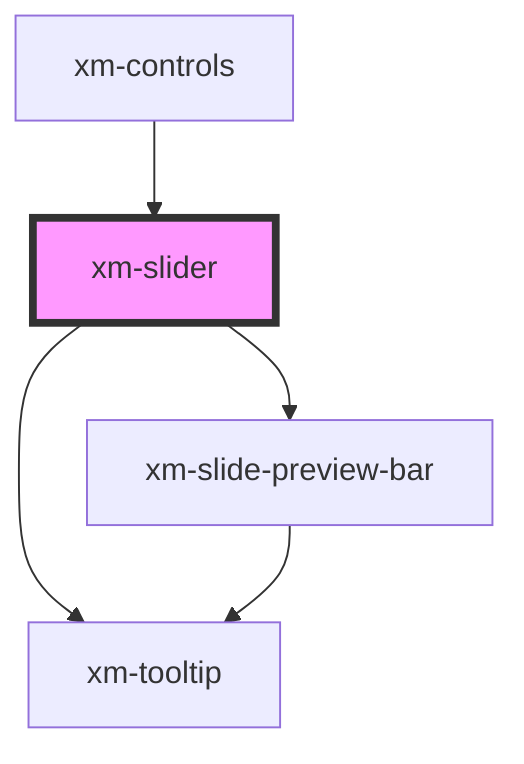

# xm-slider

<!-- Auto Generated Below -->

## Properties

| Property     | Attribute    | Description | Type       | Default     |
| ------------ | ------------ | ----------- | ---------- | ----------- |
| `duration`   | `duration`   |             | `number`   | `undefined` |
| `fullscreen` | `fullscreen` |             | `boolean`  | `undefined` |
| `progress`   | --           |             | `Progress` | `undefined` |
| `slidesSrc`  | `slides-src` |             | `string`   | `undefined` |

## Events

| Event         | Description | Type               |
| ------------- | ----------- | ------------------ |
| `slider:seek` |             | `CustomEvent<any>` |

## Shadow Parts

| Part       | Description |
| ---------- | ----------- |
| `"slider"` |             |

## Dependencies

### Used by

 - [xm-controls](../controls)

### Depends on

- [xm-slide-preview-bar](../slide-preview-bar)
- [xm-tooltip](../tooltip)

### Graph

----------------------------------------------

*Built with [StencilJS](https://stenciljs.com/)*
