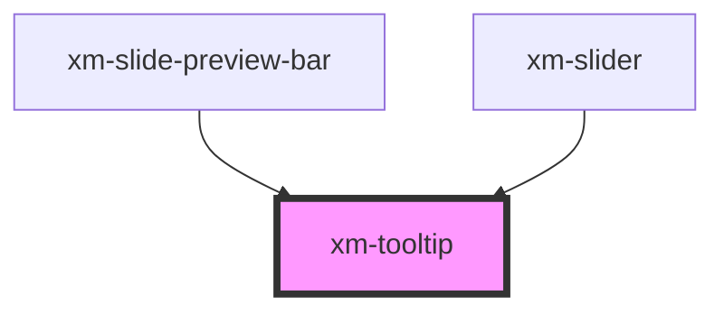

# xm-tooltip

<!-- Auto Generated Below -->

## Properties

| Property    | Attribute    | Description | Type      | Default     |
| ----------- | ------------ | ----------- | --------- | ----------- |
| `content`   | `content`    |             | `string`  | `undefined` |
| `image`     | `image`      |             | `string`  | `undefined` |
| `positionX` | `position-x` |             | `number`  | `undefined` |
| `show`      | `show`       |             | `boolean` | `undefined` |

## Dependencies

### Used by

 - [xm-slide-preview-bar](../slide-preview-bar)
 - [xm-slider](../slider)

### Graph

----------------------------------------------

*Built with [StencilJS](https://stenciljs.com/)*
