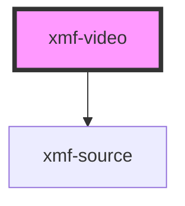

# video-player

<!-- Auto Generated Below -->

## Properties

| Property | Attribute | Description | Type     | Default     |
| -------- | --------- | ----------- | -------- | ----------- |
| `src`    | `src`     |             | `string` | `undefined` |

## Methods

### `_exitFullscreen() => Promise<void>`

#### Returns

Type: `Promise<void>`

### `_requestFullscreen() => Promise<void>`

#### Returns

Type: `Promise<void>`

### `pause() => Promise<any>`

#### Returns

Type: `Promise<any>`

### `play() => Promise<any>`

#### Returns

Type: `Promise<any>`

## Dependencies

### Depends on

- [xmf-source](../source)

### Graph

----------------------------------------------

*Built with [StencilJS](https://stenciljs.com/)*
