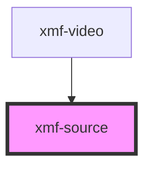

# xmf-source

<!-- Auto Generated Below -->

## Properties

| Property   | Attribute  | Description | Type      | Default     |
| ---------- | ---------- | ----------- | --------- | ----------- |
| `controls` | `controls` |             | `boolean` | `undefined` |
| `src`      | `src`      |             | `number`  | `undefined` |
| `type`     | `type`     |             | `string`  | `undefined` |

## Events

| Event  | Description | Type               |
| ------ | ----------- | ------------------ |
| `play` |             | `CustomEvent<any>` |

## Methods

### `getDuration() => Promise<any>`

#### Returns

Type: `Promise<any>`

### `load(id: any) => Promise<void>`

#### Returns

Type: `Promise<void>`

### `pause() => Promise<any>`

#### Returns

Type: `Promise<any>`

### `play() => Promise<any>`

#### Returns

Type: `Promise<any>`

## Dependencies

### Used by

 - [xmf-video](../video)

### Graph

----------------------------------------------

*Built with [StencilJS](https://stenciljs.com/)*
