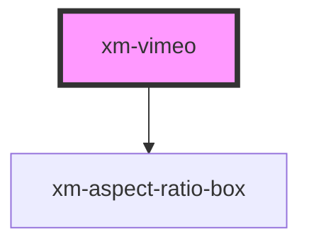

# xmf-source

<!-- Auto Generated Below -->

## Properties

| Property | Attribute | Description    | Type     | Default     |
| -------- | --------- | -------------- | -------- | ----------- |
| `src`    | `src`     | Vimeo Video ID | `number` | `undefined` |
| `volume` | `volume`  |                | `number` | `undefined` |

## Events

| Event         | Description                                                                                                                     | Type               |
| ------------- | ------------------------------------------------------------------------------------------------------------------------------- | ------------------ |
| `buffered`    |                                                                                                                                 | `CustomEvent<any>` |
| `buffering`   |                                                                                                                                 | `CustomEvent<any>` |
| `ended`       | Emit when video has ended                                                                                                       | `CustomEvent<any>` |
| `pause`       |                                                                                                                                 | `CustomEvent<any>` |
| `play`        |                                                                                                                                 | `CustomEvent<any>` |
| `progress`    |                                                                                                                                 | `CustomEvent<any>` |
| `ratioLoaded` | Emit ratio as soon as it is available                                                                                           | `CustomEvent<any>` |
| `seeked`      |                                                                                                                                 | `CustomEvent<any>` |
| `seeking`     |                                                                                                                                 | `CustomEvent<any>` |
| `timeupdate`  | Emit timeupdate event to update player controls with duration This needs to happen once initially and on every video timeupdate | `CustomEvent<any>` |

## Methods

### `currentTime() => Promise<number>`

#### Returns

Type: `Promise<number>`

### `getAspectRatio() => Promise<number>`

#### Returns

Type: `Promise<number>`

### `getDimensions() => Promise<{ width: number; height: number; }>`

#### Returns

Type: `Promise<{ width: number; height: number; }>`

### `getDuration() => Promise<number>`

#### Returns

Type: `Promise<number>`

### `pause() => Promise<void>`

#### Returns

Type: `Promise<void>`

### `play() => Promise<void>`

#### Returns

Type: `Promise<void>`

### `seek(seconds: number) => Promise<number>`

#### Returns

Type: `Promise<number>`

### `setPlaybackRate(playbackRate: number) => Promise<number>`

#### Returns

Type: `Promise<number>`

## Dependencies

### Depends on

- [xm-aspect-ratio-box](../aspect-ratio-box)

### Graph

----------------------------------------------

*Built with [StencilJS](https://stenciljs.com/)*
