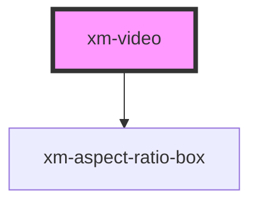

# xmf-source

<!-- Auto Generated Below -->

## Properties

| Property | Attribute | Description    | Type     | Default     |
| -------- | --------- | -------------- | -------- | ----------- |
| `src`    | `src`     | Vimeo Video ID | `number` | `undefined` |

## Methods

### `currentTime() => Promise<number>`

#### Returns

Type: `Promise<number>`

### `getAspectRatio() => Promise<number>`

#### Returns

Type: `Promise<number>`

### `getDimensions() => Promise<{ width: number; height: number; }>`

#### Returns

Type: `Promise<{ width: number; height: number; }>`

### `getDuration() => Promise<number>`

#### Returns

Type: `Promise<number>`

### `pause() => Promise<void>`

#### Returns

Type: `Promise<void>`

### `play() => Promise<void>`

#### Returns

Type: `Promise<void>`

### `seek(seconds: number) => Promise<number>`

#### Returns

Type: `Promise<number>`

## Dependencies

### Depends on

- [xm-aspect-ratio-box](../aspect-ratio-box)

### Graph

----------------------------------------------

*Built with [StencilJS](https://stenciljs.com/)*
